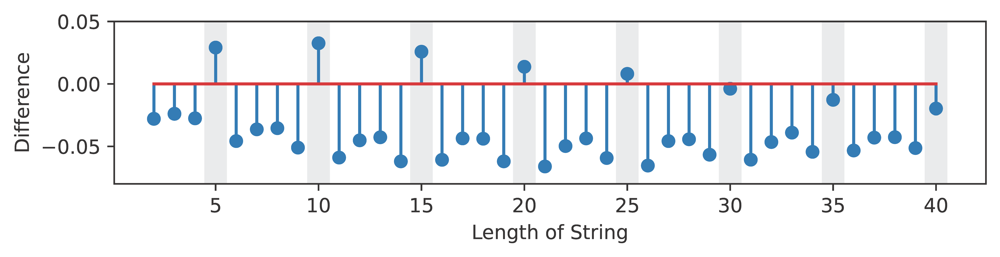

# QFA-Toolkit: A Toolkit for Quantum Finite-State Automata

<!--toc:start-->
- [QFA-Toolkit: A Toolkit for Quantum Finite-State Automata](#qfa-toolkit-a-toolkit-for-quantum-finite-state-automata)
  - [About QFA-Toolkit](#about-qfa-toolkit)
    - [Density Mapping](#density-mapping)
      - [Experimental Results](#experimental-results)
  - [Dependency and Installation](#dependency-and-installation)
  - [Quick Tour](#quick-tour)
  - [Functionalities](#functionalities)
  - [Reading Materials for QFA](#reading-materials-for-qfa)
  - [Test](#test)
  - [Citation](#citation)
<!--toc:end-->

## About QFA-Toolkit

Constructing quantum finite-state automata (QFAs) from scratch is challenging
for those without knowledge of quantum mechanics or formal language theory.
This complexity arises from the constraints on transitions in QFAs, where
transitions must adhere to the properties of a unitary matrix. Properly
constructed QFAs are still prone to obtaining practical results that deviate
significantly from theoretical ones, due to the high error rate associated with
quantum computers. This discrepancy is attributed to errors introduced during
computation, which can alter the bit-representation of each state in the QFA
circuit.

QFA-Toolkit is a framework that addresses these challenges and enhances
simulation accuracy by providing intuitive QFA composition methods alongside
improvements to the transpilation process from QFAs to quantum circuits. Our
framework enables users to compose complex QFAs from simple QFAs using language
operations. The intended workflow of our proposed framework is threefold: (1)
constructing simple QFAs, (2) combining these simple QFAs with language
operations to compose a *complex* QFA and (3) transpiling the resulting complex
QFA into a circuit using density mapping. The given workflow lends to a more
intuitive approach to quantum circuit construction as well as improved
simulation accuracy therein.


### Density Mapping

In our proposed framework, we also introduce the novel concept of \emph{density
mapping}, a method employed in our framework for determining the
bit-representation of each state in a QFA during transpilation. Density mapping
is designed to reduce the probability of fluctuation caused by bit-flip errors.


#### Experimental Results

We demonstrate the usefulness of the density mapping for emulating QFAs. The
following figure shows the difference in accepting probability from using the
naive mapping to using the density mapping on the language of strings whose
length is a multiple of 5 on a qiskit simulator.



## Dependency and Installation

Our dependencies are managed by `pyproject.toml`.
The main dependencies are numpy and qiskit.

You can install our package with the following commands.
```bash
git clone git@github.com:sybaik1/qfa-toolkit.git
cd qfa-toolkit
pip install .
```

## Quick Tour

You can import the qfa-toolkit as a Python package and use each of the classes
to construct and test your QFA or QFL. Building a QFA can be done by defining
the transitions and accepting (rejecting) states of the QFA.
```python
import numpy as np
import math
from qfa_toolkit.quantum_finite_state_automaton import (
    MeasureOnceQuantumFiniteStateAutomaton as Moqfa)

# Moqfa construction
theta = math.pi / 3
a, b = math.cos(theta), math.sin(theta)
acceptings = np.array([1,0], dtype=bool)
transitions = np.array([
    [
        [1, 0],
        [0, 1],
    ],
    [
        [a, b],
        [-b, a],
    ],
    [
        [1, 0],
        [0, 1],
    ],
], dtype=np.cfloat)
moqfa = Moqfa(transitions, acceptings)
```

If you want to build a QFL, you need to additionally give the accepting
strategy for the language.

```python
from qfa_toolkit.quantum_finite_state_automaton_language import (
    MeasureOnceQuantumFiniteStateAutomatonLanguage as Moqfl)
from qfa_toolkit.recognition_startegy import (
    NegativeOneSidedBoundedError as NegOneSided)

# Moqfl construction
strategy = NegOneSided(0.5)
moqfl = Moqfl(moqfa, strategy)
```

Now you can make a quantum circuit for simulation.
Also, you can simulate the circuit with the qiskit simulator.

```python
from qiskit.providers.basic_provider import BasicSimulator
from qfa_toolkit.qiskit_converter import (
    QiskitMeasureOnceQuantumFiniteStateAutomaton as QMoqfa)

# Circuit initialisation
qiskit_moqfa = QMoqfa(moqfa)
word = [1] * 3
circuit = qiskit_moqfa.get_circuit_for_string(word)

# Circuit simulation on Qiskit
simulator = BasicSimulator()
job = simulator.run(circuit, shots=10000)
result = job.result()
counts = {
    int(k, base=2): v
    for k, v in result.get_counts().items()
}
observed_acceptance = sum(
    counts.get(state, 0) for state in counts in qiskit_moqfa.accepting_states)
observed_rejectance = sum(
    counts.get(state, 0) for state in counts in qiskit_moqfa.rejecting_states)
print(f'acceptance: {observed_acceptance}\n'
      f'rejectance: {observed_rejectance}')
```
A similar process can be done with MMQFAs. Also, you can do operations on QFLs
to get the different languages you desire.

## Functionalities

Go to the document ([link](./document.pdf)) to see the details of each class's
functionalities.

## Reading Materials for QFA

If you're not familiar with QFAs and want to learn more about QFAs you can find
the basics in the material
([link](https://is.muni.cz/th/dy49n/b-thesis-QFA.pdf)).

## Test

For testing, there are additional dependencies with scipy.
The testing is done by unittest module by Python.
Within the installed environment you can run the following test.

```bash
python3 -m unittest
```

## Citation

```bibtex
@misc{BaikSH24,
    title={A Framework for Quantum Finite-State Languages with Density Mapping},
    author={SeungYeop Baik and Sicheol Sung and Yo-Sub Han},
    year={2024},
    eprint={2407.02776},
    archivePrefix={arXiv},
    primaryClass={cs.CL},
    url={https://arxiv.org/abs/2407.02776}, 
}
```
